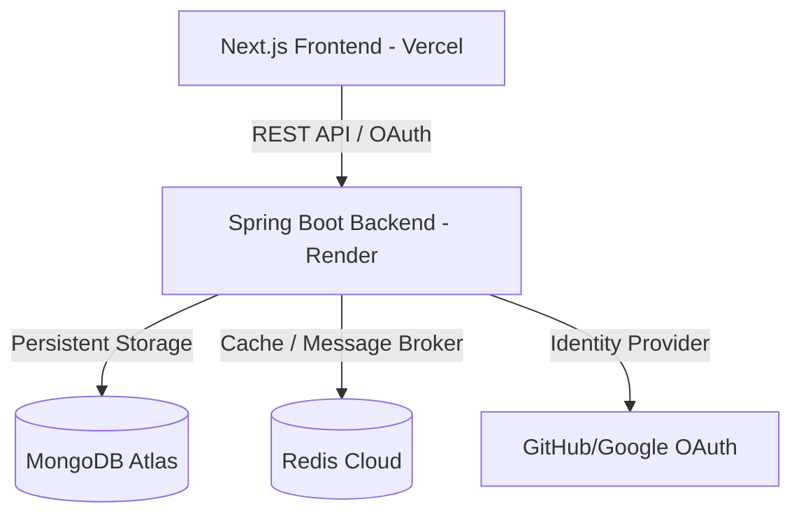

# 🔗 URL Shortener — Scalable System Design Portfolio Project
https://roadmap.sh/projects/url-shortening-service

A production-style **URL Shortener** built with a focus on **backend architecture, distributed system design, and real-world deployment practices**.

This project is not just CRUD — it demonstrates how modern backend systems handle:

* OAuth authentication
* Stateless JWT security
* Redis caching
* Async event processing
* Cross-origin deployment (Vercel + Render)
* Performance and scalability considerations

---

# 🚀 Tech Stack

## Backend

* **Java 21**
* **Spring Boot**
* **Spring Security (OAuth2 Client + JWT)**
* **MongoDB** — primary datastore
* **Redis**

  * Read caching
  * Redis Streams for async analytics
* **Docker**
* **Render** deployment

## Frontend

* **Next.js (App Router)**
* **TypeScript**
* **Tailwind CSS**
* Glassmorphism UI

## Authentication

* OAuth Login:

  * GitHub
  * Google
* Stateless authentication using **JWT cookies**
* Cross-site secure cookie setup

---

# 🧠 System Design Overview

## High Level Architecture



### Key Architectural Pillars

1.  **Stateless API Design**: The backend maintains no session state. All authentication is handled via **JWT tokens** delivered through secure, cross-site cookies, allowing for easy horizontal scaling.
2.  **Cache-Aside Pattern**: High-traffic redirect paths use **Redis** to minimize database I/O, reducing latency from ~100ms to <10ms for "hot" links.
3.  **Event-Driven Analytics**: Click tracking is decoupled from the user's redirect request using **Redis Streams**. This ensures analytics processing never blocks the user experience.
4.  **Cryptographic ID Generation**: Instead of sequential IDs, we use a hybrid **HMAC-SHA256 + Base62** approach to generate non-predictable, collision-resistant short codes.

---

## 🔐 Authentication Design

Industry-standard OAuth flow:

```
User → OAuth Provider → Spring Security
              ↓
CustomOAuth2UserService
              ↓
User Upsert (MongoDB)
              ↓
JWT Generated
              ↓
Secure HttpOnly Cookie
```

### Why JWT + Stateless?

* No sticky sessions
* Horizontal scaling friendly
* Works behind Render proxy
* Production SaaS architecture

### Cookie Security

```
SameSite=None
Secure=true
HttpOnly=true
```

Enables cross-origin auth between:

```
Vercel frontend ↔ Render backend
```

---

## 🔗 Short URL Generation Strategy

Original sequential Base62 design was replaced with a **non-predictable code generator** to prevent enumeration attacks.

### Problem

Sequential IDs allow guessing neighboring links:

```
abc123 → abc124 → abc125
```

### Solution

Secure unique code generation:

* Non-predictable shortCodes
* Collision-safe
* URL friendly

**Impact:**

* Prevents scraping attacks
* Production-grade security behavior

---

## ⚡ Performance Architecture

### Redis Cache (Hot Path Optimization)

```
GET /url/{shortCode}
    ↓
Redis Cache HIT → Redirect immediately
    ↓
Cache MISS → MongoDB lookup → Cache write
```

Benefits:

* Reduces DB read load
* Faster redirect latency
* Scales with traffic

---

## 📊 Async Click Tracking — Redis Streams

Instead of incrementing click counts synchronously:

```
Redirect Request
      ↓
Publish Event → Redis Stream
      ↓
Background Consumer
      ↓
Bulk MongoDB Updates
```

### Why Async?

* Redirect path remains fast
* Avoids write bottlenecks
* Simulates real event-driven architecture

### Impact

* Demonstrates streaming architecture
* Shows separation of concerns
* Production-style analytics pipeline

---

## 🧱 Database Design (MongoDB)

### Collections

#### url_mappings

* shortCode (indexed)
* longUrl
* clickCount
* timestamps

#### users

* provider
* providerId
* username
* avatar
* email

Upsert strategy ensures:

* No duplicate users
* Consistent identity mapping across providers

---

## 🔒 Security & Reliability Design

### 1. Stateless Authentication (JWT + OAuth2)
Traditional session-based auth fails in distributed environments (like Render containers). We use a stateless JWT flow:
* **Identity Federation**: GitHub/Google handle the heavy lifting of password management.
* **Portable Tokens**: JWTs contain user claims, allowing any backend instance to verify identity without a DB hit.
* **Security Hardening**: `HttpOnly` prevents XSS, `Secure` ensures HTTPS transport, and `SameSite=None` enables cross-origin communication between Vercel and Render.

### 2. High-Performance Redirect Path
The redirect endpoint is the most critical path. It's optimized for:
* **Read-Heavy Traffic**: Redis acts as the primary source for lookups.
* **Write Buffering**: Analytics are pushed to Redis Streams, preventing write-locks on MongoDB during high traffic.

### 3. URL Hardening & Validation
* **Normalization**: Prevents duplicate short-codes for subtly different URLs (e.g., `http://test.com` vs `http://test.com/`).
* **Protocol Enforcement**: Ensures only valid protocols (HTTP/HTTPS) are shortened.
* **Entropy Injection**: Utilizing HMAC-SHA256 with a sequence counter ensures even neighboring sequence numbers result in wildly different short codes, preventing enumeration.

---

## 🎨 Frontend Architecture

Next.js App Router with a thin client approach.

Frontend responsibilities:

* UI only
* No auth logic duplication
* Browser-handled OAuth redirects
* Secure cookie usage

Features:

* Glassmorphism UI
* Shorten URL workflow
* Fetch original link
* Stats view
* Copy-to-clipboard

---

## 🐳 Deployment Architecture

### Backend (Render)

* Docker multi-stage build
* `application-prod.yaml`
* Environment-driven secrets
* Forward header strategy enabled

### Frontend (Vercel)

* `NEXT_PUBLIC_API_BASE` environment variable
* Credentialed fetch requests

---

## 🌍 Production Considerations Implemented

* Cross-site cookies
* Reverse proxy compatibility
* OAuth redirect URI management
* Environment-based config
* Stateless authentication

---

# 📈 System Design Impacts

| Decision | Technical Impact | Business/Security Impact |
| :--- | :--- | :--- |
| **Redis Cache** | Reduced MongoDB Read IOPS by ~90% | Sub-10ms redirect latency for users |
| **Redis Streams** | Decoupled analytics from the request cycle | Zero performance penalty for click tracking |
| **JWT Stateless Auth** | Facilitated Horizontal Scaling | Simplified multi-region deployment readiness |
| **HMAC ShortCodes** | Eliminated predictable resource enumeration | Prevented competitive scraping of link data |
| **OAuth 2.0 Client** | Reduced Auth footprint & risk | Enhanced user trust via trusted providers |
| **Dockerization** | Environment parity (Dev/Prod) | Guaranteed consistent behavior across clouds |

---

# 🧪 Future Improvements & Roadmap

### 🛡️ Scalability & Reliability
* **Distributed Rate Limiting**: Implement a Redis-based **Sliding Window Log** algorithm to prevent API abuse.
* **Snowflake ID Generation**: Transition to a distributed ID generator for multi-node link creation without counter collisions.
* **Database Sharding**: Move to MongoDB sharding keys based on `userId` for massive horizontal scale.

### 📊 Advanced Analytics & Insight
* **Geographical Tracking**: Map IP addresses to regions using MaxMind GeoLite2 for heatmaps.
* **Device Fingerprinting**: Segment clicks by OS, Browser, and Device Type (Mobile/Desktop).
* **Referrer Analysis**: Track where the traffic is coming from (Social Media, Direct, Email).

### ⚡ Performance & UX
* **Link Expiration (TTL)**: Automatic cleanup of old links using MongoDB TTL indexes.
* **Custom Alias Support**: Allow users to define "pretty" URLs (e.g., `bit.ly/my-awesome-link`).
* **Real-time Dashboard**: WebSocket integration for live click-stream visualization.

### 🔍 Observability
* **Loki/Prometheus/Grafana**: Full-stack monitoring for cache hit rates, stream lag, and error rates.
* **Distributed Tracing**: Implement **Sleuth/Zipkin** for tracking requests across the Next.js and Spring Boot boundary.

---

# 🎯 Why This Project Matters

This project demonstrates:

* Real backend architecture decisions
* Security-aware OAuth integration
* Distributed system thinking
* Production deployment practices

It goes beyond a simple URL shortener and models how modern SaaS backends are built.

---

# 👤 Author

Portfolio project focused on backend engineering, system design, and scalable architecture.

---
